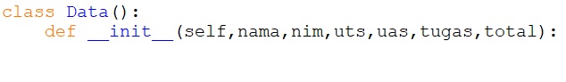
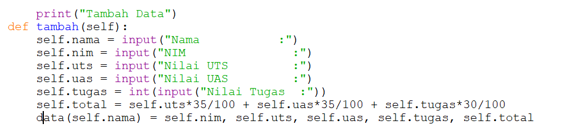
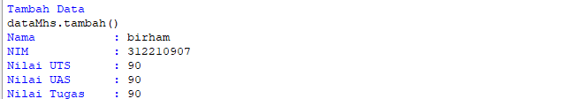
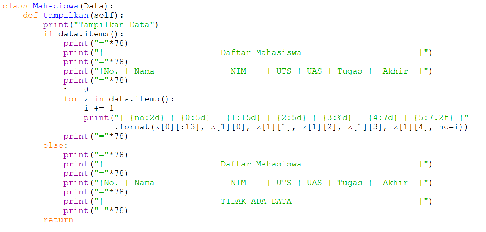
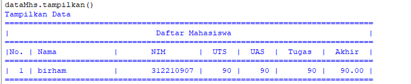
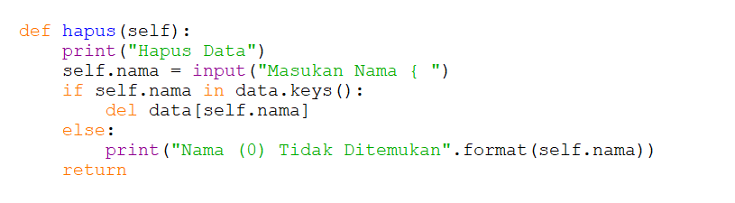
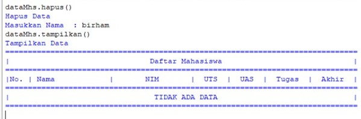
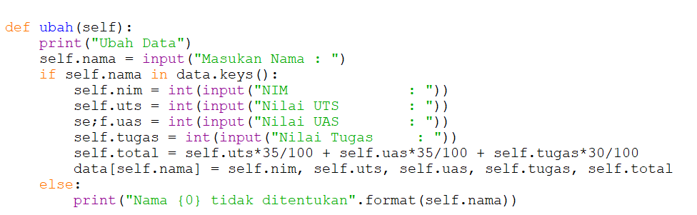
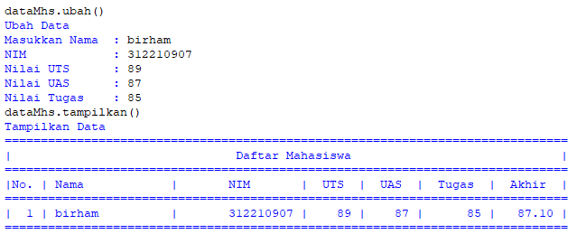

## PROSES / LANGKAH - LANGKAH PRAKTIKUM 8

# Tugas Praktikum

Buat program sederhana dengan mengaplikasikan penggunaan class. Buatlah class untuk menampilkan daftar nilai mahasiswa, Dengan ketentuan:

- Method -tambah() Untuk menambah data
- Method -tampilkan() Untuk menampilkan data
- Method -hapus(nama) Untuk menghapus data berdasarkan nama
- Method -ubah(nama) Untuk mengubah data berdasarkan nama
- Buatlah diagram class, Flowchart dan penjelasan pada README.md
- Commit dan push repository ke Github

# Daftar nilai mahasiswa menggunakan class

- Langkah pertama kuta akan membuat class terlebih dahulu 

- Kemudian langkah kedua kita masukan fungsi -tambah() di indui class

# Fungsi untuk menambahkan data

- Kemudian langkah ketiga kita kembali kembuat class tapi untuk yang kedua yaitu turunn dari class induk
- Langkah ke empat kita memasukan sisa fungsi pada turunan terakhir

# Fungsi untuk menampilkan Data

# Fungsi untuk Menghapus Data berdasarkan nama

# Fungsi untuk Mengubah Data berdasarkan nama

- Kemudian yang terakhir ketika kita ingin memanggil class kita hanya cukup menggunakan atau menambahkan 1 variabel sebagai dorongan class beserta fungsi 

dataMhs("Mahasiswa("nama","nim","uts","uas","tugas","total")

dataMhs.tambah()

dataMhs.tampilkan()

dataMhs.ubah()

dataMhs.hapus()

dataMhs.tampilkan()
